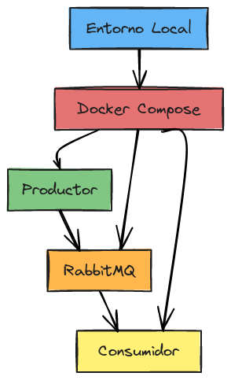

# rabbitmq-demo

## Limpieza de Docker y Levantamiento del Entorno Local

> Ejecutar desde la raíz del proyecto, donde se encuentra el archivo `docker-compose.yml`.

### 1. Detener y eliminar recursos de Docker Compose

```
docker-compose down --volumes --remove-orphans
```

### 2. Limpiar recursos de Docker no utilizados

```
docker container prune -f			# Eliminar contenedores detenidos
docker volume prune -f				# Eliminar volúmenes no utilizados
docker network prune -f				# Eliminar redes no utilizadas
docker image prune -a -f			# (Opcional) Eliminar imágenes no utilizadas
docker system prune -a --volumes -f # Borra imágenes no usadas, contenedores detenidos, redes no conectadas y todos los volúmenes
```

### 3. Levantar el entorno con nuevo build

```
docker-compose up -d --build
```

<!-- Diagrama de arquitectura https://www.blocksandarrows.com/ -->
<p align="center">
  
</p>