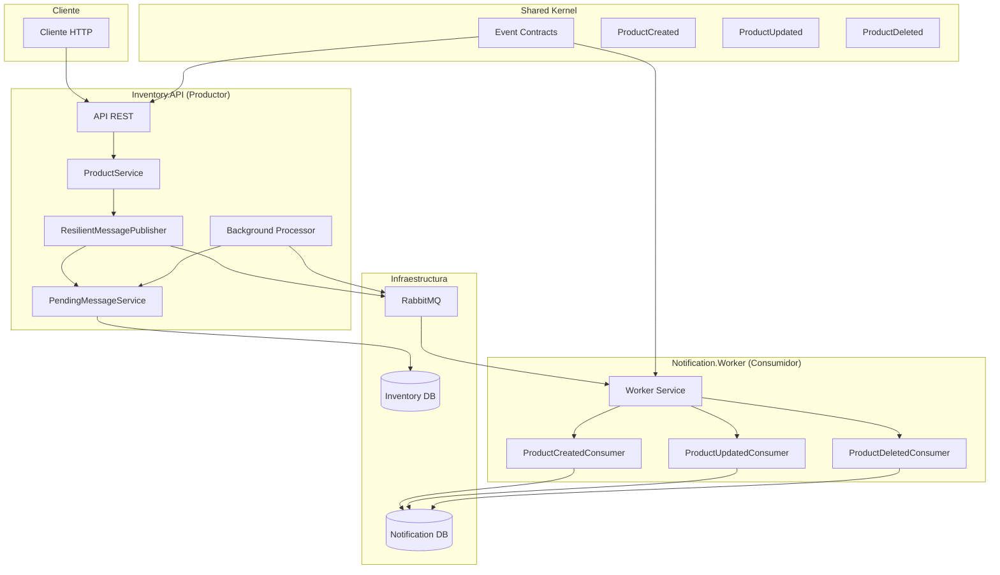
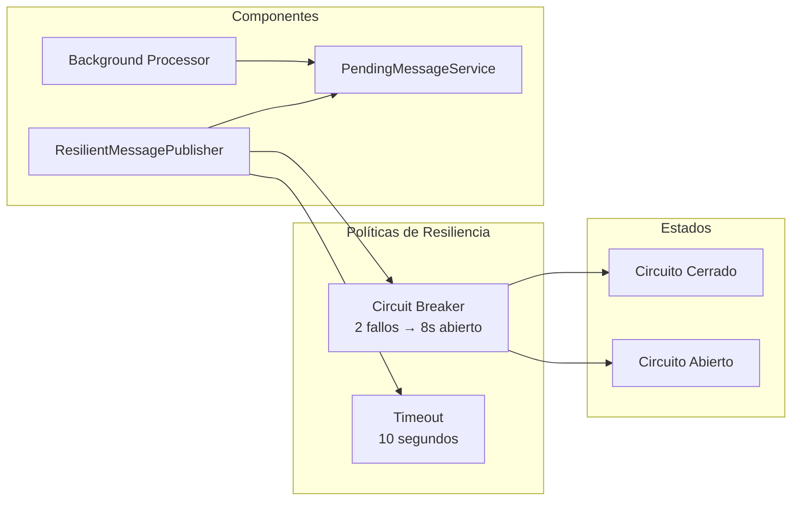

# rabbitmq-demo

## Resumen del Proyecto

Este proyecto implementa una arquitectura resiliente de mensajería basada en RabbitMQ, usando .NET 8, MassTransit y Polly. El sistema garantiza que los eventos críticos (creación, actualización y eliminación de productos) no se pierdan aunque RabbitMQ esté caído, gracias a la persistencia de mensajes pendientes y su reprocesamiento automático.

## Limpieza de Docker y Levantamiento del Entorno Local

> Ejecutar desde la raíz del proyecto, donde se encuentra el archivo `docker-compose.yml`.

### 1. Detener y eliminar recursos de Docker Compose

```
docker-compose down --volumes --remove-orphans
```

### 2. Limpiar recursos de Docker no utilizados

```
docker container prune -f      # Eliminar contenedores detenidos
docker volume prune -f         # Eliminar volúmenes no utilizados
docker network prune -f        # Eliminar redes no utilizadas
docker image prune -a -f       # (Opcional) Eliminar imágenes no utilizadas
docker system prune -a --volumes -f # Borra imágenes no usadas, contenedores detenidos, redes no conectadas y todos los volúmenes
```

### 3. Levantar el entorno con nuevo build

```
docker-compose up -d --build
```

<!-- Diagrama de arquitectura https://www.blocksandarrows.com/ -->
<p align="center">
  
</p>

## Arquitectura General de la Solución



## Resiliencia y Persistencia de Mensajes

El sistema utiliza **Polly** para aplicar políticas de resiliencia al publicar eventos en RabbitMQ:

- **Timeout:** Si la publicación tarda más de 10 segundos, se considera fallida.
- **Circuit Breaker:** Si ocurren 2 fallos consecutivos, el circuito se abre durante 8 segundos y no se intentan más publicaciones.
- **Persistencia de mensajes:** Si ocurre un error (timeout, circuito abierto u otro), el evento se guarda en la tabla `PendingMessages` de la base de datos.
- **Procesamiento automático:** Un servicio en background intenta republicar los mensajes pendientes cada 30 segundos, hasta un máximo de 5 reintentos por mensaje.

### Diagrama de Políticas de Resiliencia



### Flujo de Publicación Resiliente

1. **API recibe una solicitud** (crear, actualizar o eliminar producto).
2. **Se publica un evento** usando `ResilientMessagePublisher`.
3. Si la publicación falla (timeout, circuito abierto, error inesperado):
   - El evento se guarda como pendiente en la base de datos.
   - El endpoint responde con 503 o 504, indicando que el mensaje será procesado cuando RabbitMQ esté disponible.
4. **Servicio en background** intenta republicar los mensajes pendientes cada 30 segundos.
5. Si el mensaje se publica exitosamente, se marca como procesado.
6. Si un mensaje excede 5 reintentos, se deja de intentar y se registra el error.

## Endpoints de la API

[http://localhost:5000/swagger/index.html](http://localhost:5000/swagger/index.html)

### Endpoints Principales

#### **Productos**
- `GET /api/products` - Obtener todos los productos
- `GET /api/products/{id}` - Obtener producto por ID
- `POST /api/products` - Crear nuevo producto (publica evento resiliente)
- `PUT /api/products/{id}` - Actualizar producto (publica evento resiliente)
- `DELETE /api/products/{id}` - Eliminar producto (publica evento resiliente)

#### **Categorías**
- `GET /api/categories` - Obtener todas las categorías

## Características Técnicas

- **API REST completa** con endpoints CRUD para productos y consulta de categorías
- **Integración con RabbitMQ** usando exchange direct
- **Resiliencia avanzada** con Polly (Timeout + Circuit Breaker)
- **Persistencia de mensajes** para evitar pérdidas
- **Procesamiento automático** de mensajes pendientes en background
- **Docker Compose** para el ambiente completo
- **Documentación Swagger** incluida
- **Manejo de errores** y reintentos limitados
- **Arquitectura limpia** con separación de responsabilidades

## Beneficios del Sistema

- **No pérdida de mensajes** cuando RabbitMQ está caído
- **Procesamiento automático** cuando el servicio se recupera
- **Reintentos inteligentes** con límite configurable (5)
- **Monitoreo detallado** con logs estructurados
- **Limpieza automática** de mensajes procesados
- **Escalabilidad** con procesamiento en background
- **Resiliencia** con políticas de timeout y circuit breaker

## Migraciones EF Core (en modo desarrollo)
#### Setear  como proyecto principal API y en Package Manager Console (apuntando a Infrastructure) ejecutar los siguientes comandos:
```
Add-Migration Initial -Context InventoryDbContext -OutputDir Migrations
Update-Database  -Context InventoryDbContext
Remove-Migration -Context InventoryDbContext
```

#### Setear  como proyecto principal Worker y en Package Manager Console (apuntando a Infrastructure) ejecutar los siguientes comandos:
```
Add-Migration Initial -Context NotificationDbContext -OutputDir Migrations
Update-Database  -Context NotificationDbContext
Remove-Migration -Context NotificationDbContext
```
