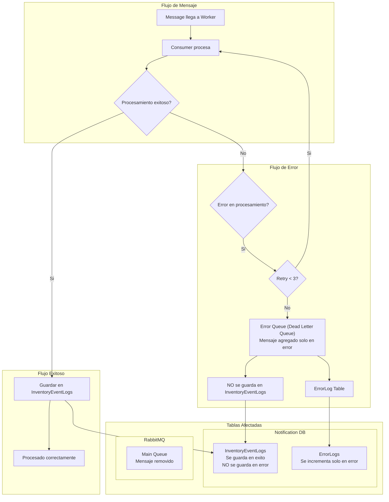

# rabbitmq-demo

## Resumen del Proyecto

Este proyecto implementa una arquitectura resiliente de mensajería basada en RabbitMQ, usando .NET 8, MassTransit y Polly. El sistema garantiza que los eventos críticos (creación, actualización y eliminación de productos) no se pierdan aunque RabbitMQ esté caído, gracias a la persistencia de mensajes pendientes y su reprocesamiento automático.

## Limpieza de Docker y Levantamiento del Entorno Local

> Ejecutar desde la raíz del proyecto, donde se encuentra el archivo `docker-compose.yml`.

### 1. Detener y eliminar recursos de Docker Compose

```
docker compose down --volumes --remove-orphans
```

### 2. Limpiar recursos de Docker no utilizados

```
docker container prune -f      # Eliminar contenedores detenidos
docker volume prune -f         # Eliminar volúmenes no utilizados
docker network prune -f        # Eliminar redes no utilizadas
docker image prune -a -f       # (Opcional) Eliminar imágenes no utilizadas
docker system prune -a --volumes -f # Borra imágenes no usadas, contenedores detenidos, redes no conectadas y todos los volúmenes
```

### 3. Levantar el entorno con nuevo build

```
docker compose up -d --build
```

<!-- Diagrama de arquitectura https://www.blocksandarrows.com/ -->
<p align="center">
  
</p>


## Endpoints de la API

[http://localhost:5006/swagger/index.html](http://localhost:5006/swagger/index.html)

## Desde una instancia de amazon EC2 (Linux) con Docker instalado, se puede acceder a la API en la siguiente URL:
http://34.194.153.164:5006/swagger


## Pruebas con Postman

### Descargar la Colección

1. **Descargar la colección**: [RabbitMqDemo.postman_collection.json](RabbitMqDemo.postman_collection.json)
2. **Importar en Postman**:
   - Abrir Postman
   - Hacer clic en "File" y luego "Import"
   - Seleccionar el archivo `RabbitMqDemo.postman_collection.json`
   - La colección se importará automáticamente

### Endpoints Incluidos en la Colección

#### **Productos**
- `GET /api/products` - Obtener todos los productos
- `GET /api/products/{id}` - Obtener producto por ID
- `POST /api/products` - Crear nuevo producto
- `PUT /api/products/{id}` - Actualizar producto
- `DELETE /api/products/{id}` - Eliminar producto

#### **Categorías**
- `GET /api/categories` - Obtener todas las categorías

---

## Arquitectura General de la Solución


## Resiliencia y Persistencia de Mensajes

El sistema utiliza **Polly** para aplicar políticas de resiliencia al publicar eventos en RabbitMQ:

- **Timeout:** Si la publicación tarda más de 10 segundos, se considera fallida.
- **Circuit Breaker:** Si ocurren 2 fallos consecutivos, el circuito se abre durante 8 segundos y no se intentan más publicaciones.
- **Persistencia de mensajes:** Si ocurre un error (timeout, circuito abierto u otro), el evento se guarda en la tabla `PendingMessages` de la base de datos.
- **Procesamiento automático:** Un servicio en background intenta republicar los mensajes pendientes cada 30 segundos, hasta un máximo de 5 reintentos por mensaje.

### Diagrama de Políticas de Resiliencia


### Flujo de Publicación Resiliente

1. **API recibe una solicitud** (crear, actualizar o eliminar producto).
2. **Se publica un evento** usando `ResilientMessagePublisher`.
3. Si la publicación falla (timeout, circuito abierto, error inesperado):
   - El evento se guarda como pendiente en la base de datos.
   - El endpoint responde con 503 o 504, indicando que el mensaje será procesado cuando RabbitMQ esté disponible.
4. **Servicio en background** intenta republicar los mensajes pendientes cada 30 segundos.
5. Si el mensaje se publica exitosamente, se marca como procesado.
6. Si un mensaje excede 5 reintentos, se deja de intentar y se registra el error.


## Características Técnicas

- **API REST completa** con endpoints CRUD para productos y consulta de categorías
- **Integración con RabbitMQ** usando exchange direct
- **Resiliencia avanzada** con Polly (Timeout + Circuit Breaker)
- **Persistencia de mensajes** para evitar pérdidas
- **Procesamiento automático** de mensajes pendientes en background
- **Docker Compose** para el ambiente completo
- **Documentación Swagger** incluida
- **Manejo de errores** y reintentos limitados
- **Arquitectura limpia** con separación de responsabilidades

## Beneficios del Sistema

- **No pérdida de mensajes** cuando RabbitMQ está caído
- **Procesamiento automático** cuando el servicio se recupera
- **Reintentos inteligentes** con límite configurable (5)
- **Monitoreo detallado** con logs estructurados
- **Limpieza automática** de mensajes procesados
- **Escalabilidad** con procesamiento en background
- **Resiliencia** con políticas de timeout y circuit breaker

## Migraciones EF Core (en modo desarrollo)
#### Setear  como proyecto principal API y en Package Manager Console (apuntando a Infrastructure) ejecutar los siguientes comandos:
```
Add-Migration Initial -Context InventoryDbContext -OutputDir Migrations
Update-Database  -Context InventoryDbContext
Remove-Migration -Context InventoryDbContext
```

#### Setear  como proyecto principal Worker y en Package Manager Console (apuntando a Infrastructure) ejecutar los siguientes comandos:
```
Add-Migration Initial -Context NotificationDbContext -OutputDir Migrations
Update-Database  -Context NotificationDbContext
Remove-Migration -Context NotificationDbContext
```


---


## Flujo de Patrones de Mensajería Implementados

```mermaid
sequenceDiagram
    participant Client
    participant API as Inventory.API
    participant DB as Inventory DB
    participant Publisher as ResilientPublisher
    participant RabbitMQ
    participant Worker as Notification.Worker
    participant NotifDB as Notification DB
    
    Note over Client,NotifDB: Flujo Normal
    Client->>API: POST /api/products
    API->>DB: Save Product
    API->>Publisher: Publish Event
    Publisher->>RabbitMQ: Publish Message
    RabbitMQ->>Worker: Deliver Message
    Worker->>NotifDB: Save Event Log
    API-->>Client: 201 Created
    
    Note over Client,NotifDB: Flujo con Fallo RabbitMQ
    Client->>API: POST /api/products
    API->>DB: Save Product
    API->>Publisher: Publish Event
    Publisher->>RabbitMQ: Publish (FAILS)
    Publisher->>DB: Save as Pending
    API-->>Client: 503/504 (Mensaje guardado)
    
    Note over Client,NotifDB: Recuperación Automática
    loop Cada 30 segundos
        Publisher->>DB: Get Pending Messages
        Publisher->>RabbitMQ: Publish Pending
        Publisher->>DB: Mark as Processed
    end
```



## Flujo de Patrones de Resiliencia Implementados

```mermaid
graph LR
    subgraph "Políticas de Resiliencia"
        CB[Circuit Breaker<br/>2 fallos → 8s abierto]
        TO[Timeout<br/>10 segundos]
        RETRY[Retry Policy<br/>3 intentos cada 5s]
    end
    
    subgraph "Componentes"
        PUBLISHER[ResilientMessagePublisher]
        PENDING[PendingMessageService]
        PROCESSOR[Background Processor]
    end
    
    subgraph "Estados"
        CLOSED[Circuito Cerrado]
        OPEN[Circuito Abierto]
    end
    
    PUBLISHER --> CB
    PUBLISHER --> TO
    PUBLISHER --> PENDING
    PROCESSOR --> PENDING
    
    CB --> CLOSED
    CB --> OPEN
```



## Caso de Uso: Cuando se cae RabbitMQ

```mermaid
graph TD
    subgraph "Tablas Afectadas"
        subgraph "Inventory DB"
            Products[Products<br/>✅ Normal]
            Categories[Categories<br/>✅ Normal]
            PendingMessages[PendingMessages<br/>📈 Aumenta]
        end
        
        subgraph "Notification DB"
            InventoryEventLogs[InventoryEventLogs<br/>❌ No recibe]
            ErrorLogs[ErrorLogs<br/>❌ No recibe]
        end
    end
    
    subgraph "Comportamiento del Sistema"
        API[Inventory.API<br/>✅ Sigue funcionando]
        Worker[Notification.Worker<br/>❌ No procesa]
        Background[Background Processor<br/>⏳ Espera RabbitMQ]
    end
    
    subgraph "Recuperación"
        RabbitMQ[RabbitMQ<br/>🔄 Se recupera]
        Background --> RabbitMQ
        Background --> PendingMessages
        PendingMessages --> InventoryEventLogs
    end
```



## Caso de Uso: Cuando la cola genera error



---

